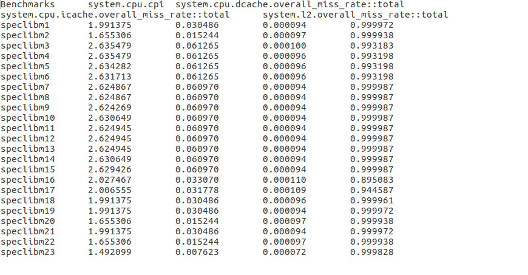
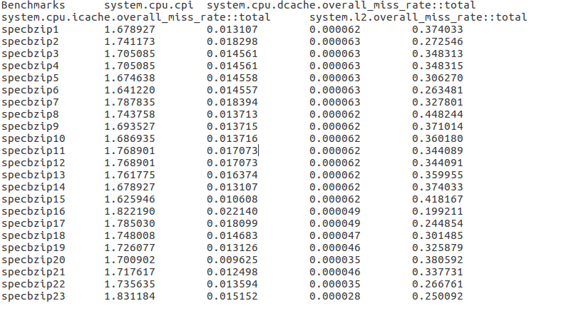
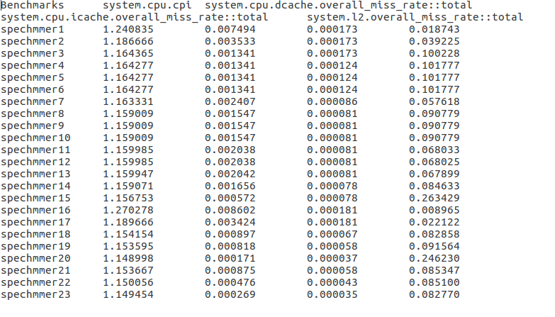
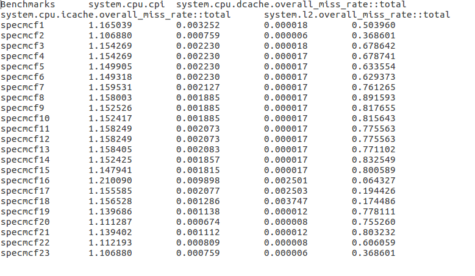

# Αρχιτεκτονική Υπολογιστών
## Εργαστήριο 2 
### Ερωτήματα πρώτου βήματος.

### 1. Βασικές παράμετροι του συστήματος
Στο πρώτο ερώτημα όπως και στο προηγούμενο εργαστήριο πρέπει να αναγνωριστούν οι
βασικές παράμετροι του συστήματος που προσομοιώνεται. Στο συγκεκριμένο ερώτημα αρκεί να βρεθούν 
τα χαρακτηριστικά της μνήμης cache. Ψάχνοντας στο αρχείο config.ini βρίσκουμαι τα παρακάτω χαρακτηριστικά


```
15:cache_line_size=64

155:system.cpu.dcache
159:assoc=2
179:size=65536

789:system.cpu.icache
793:assoc=2
813:size=32768

994:system.l2
998:assoc=8
1018:size=2097152
```
### 2. Αποτελέσματα απο τα Benchmarks
Στο δεύτερο ερώτημα πρέπει να τρέξουμε κάποια benchmarks και να συγκρίνουμε κάποια στοιχεία μεταξύ τους. Τα στοιχεία που πρέπει να καταγράψουμε είναι τα :
1)χρόνος εκτέλεσης του προγράμματος
2)CPI
3)συνολικά misses για ολες τις caches 


|    Parameter              |  specbzip   |    spechmmer    |      speclibm      |     specmcf     |  specsjeng   |
|:-------------------------:|:-----------:|:---------------:|:------------------:|:---------------:|:------------:|
|  sim_seconds              |   0.083482  |    0.057988     |      0.174672      |     0.058838    |    ----      |
| system.cpu.cpi            |  1.669644   |    1.159767     |      3.493440      |     1.176755    |    ----      |  
| icache.overall_miss_rate  |  0.000065   |    0.000154     |      0.000097      |     0.004327    |    ----      |
| dcache.overall_miss_rate  |  0.015207   |    0.001686     |      0.060971      |     0.001958    |    ----      |
|   l2.overall_miss_rate    |  0.280826   |    0.081320     |      0.999976      |     0.209396    |    ----      |


Για το benchmark specsjeng συναντίσαμε πρόβλημα. Καθως και στους 3 υπολογιστές που διαθέτουμε σαν ομάδα η προσομοίωση δεν έτρεχε και έβγαζε το εξής error :   Error: script doesn't take any positional arguments


----+++ΓΡΑΦΗΜΑΤΑ-----


### 3. Αποτελέσματα απο τα Benchmarks για συχνότητα 1GHz
Στο δεύτερο ερώτημα που τρέξαμε τα benchmarks αφήσαμε την συχνότητα του επεξεργαστή στην αρχική της τιμή ,που ειναι 2GHz. Στο συγκεκριμένο ερώτημα πρέπει να ξανατρέξουμε τις ίδιες εντολές με πρίν προσθέτοντας την παράμετρο --cpu-clock=1GHz ώστε να ορίσουμε την συχνότητα του επεξεργαστή στα 1 GHZ. Τα αποτελέσματα παρατίθονται παρακάτω.


|    Parameter              |  specbzip   |    spechmmer    |      speclibm      |     specmcf     |  specsjeng   |
|:-------------------------:|:-----------:|:---------------:|:------------------:|:---------------:|:------------:|
|  sim_seconds              |   0.159997  |    0.115700     |      0.262310      |     0.115945    |    ----      |
| system.cpu.cpi            |  1.599972   |    1.156995     |      2.623101      |     1.159451    |    ----      |  
| icache.overall_miss_rate  |  0.000065   |    0.000154     |      0.000097      |     0.004330    |    ----      |
| dcache.overall_miss_rate  |  0.015013   |    0.001679     |      0.060970      |     0.001957    |    ----      |
|   l2.overall_miss_rate    |  0.280826   |    0.081317     |      0.999976      |     0.209396    |    ----      |


Ομοίως με πριν για το benchmark specsjeng έχουμε το ίδιο πρόβλημα.

Συγκρίνοντας τις εκτελέσεις των προγραμμάτων και στις 2 περιπτώσεις και συγκρίνοντας τα αποτελέσματα για τις εγγραφές system.clk_domain.clock και cpu_cluster.clk_domain.clock παρατηρούμε οτι στο πρώτο ερώτημα οι 2 αυτές εγγραφές έχουν τις τιμες :

```
289:system.clk_domain.clock                          1000 
758:system.cpu_clk_domain.clock                       500
```
Ενώ στην δεύτερη εκτέλεση με την παράμετρο --cpu-clock=1GHz οι αντίστοιχες εγγραφές είναι 
```
289:system.clk_domain.clock                          1000 
758:system.cpu_clk_domain.clock                      1000 
```
Παρατηρούμε ότι το σύστημα έχει τουλάχιστον 2 ρολόγια. Το πρώτο το οποίο έχει σταθερή τιμή σε όλες τις εκτελέσεις είναι το ρολόι του συστήματος, το οποίο ουσιαστικά συγχρονίζει μεταξύ τους τα υπολοιπα υποσυστήματα στέλνοντας με την παραπάνω συχνότητα σήματα σε όλα τα εξαρτήματα. Το δεύτερο ρολόι το οποίο παίρνει διαφορετικές τιμές μεταξύ των κλίσεων των προγραμμάτων αφορά την ταχύτητα του επεξεργαστή, και δηλώνει πόσους κύκλους μπορεί να κάνει σε ενα δευτερόλεπτο. Γενικά το ρολόι του επεξεργαστή δουλεύει σε μεγαλύτερη συχνότητα απο το ρολόι του συστήματος έτσι ώστε να μην μένει ανεκμετάλλευτος ο επεξεργαστής για μεγάλα χρονικά διαστήματα. Τα δεδομένα αυτά μπορούν να επιβεβαιωθούν και απο τα αποτελέσματα των benchmarks καθώς είναι ολοφάνερο πως στη πρώτη περίπτωση όπου η συχνότητα ήταν διπλάσια ο χρόνος εκτέλεσης ήταν πολύ λιγότερος και σχεδόν ο μισός σε κάποιες περιπτώσεις.


---+++ΝΑ ΠΡΟΣΘΕΣΩ και αλλες λεπτομεριες ?!---


### Ερωτήματα δεύτερου βήματος.
Για το δεύτερο ερώτημα έπρεπε να βελτιώσουμε τα αποτελέσματα των benchmarks και συγκεκριμένα να βελτιώσουμε το CPI το οποιο πρέπει να βρίσκεται όσο πιο κοντά στην μονάδα γίνεται. Για την επίτευξη αυτού του στόχου μπορούσαμε να αλλάξουμε κάποιες συγκεκριμένες παραμέτρους των συστημάτων, οι οποίες είναι 
```
L1 instruction cache size
L1 instruction cache associativity
L1 data cache size
L1 data cache associativity
L2 cache size
L2 cache associativity
Μέγεθος cache line
```
Οι τιμές τις οποίες διαλέξαμε στηρίζόνταν στο γεγονός πως όσο μεγαλύτερες είναι οι μνήμες τόσο μειώνονται τα misses των caches και συνεπώς τοσο μειώνεται και ο χρόνος αναμονής του επεξεργαστή για την ανάκτηση των δεδομένων.

Εμείς για τα συγκεκριμένα benchmarks τρέξαμε περίπου 25 δυνατούς συνδιασμούς. Στο παρακάτω πινακάκι φαίνονται οι συνδιασμοί που χρησιμοποιήθηκαν και με την σειρά με τιν οποία έγιναν.


| no | l1d_size | l1i_size | l2_size | l1i_associativity | l1d_associativity | l2_associativity | cacheline_size |
|----|----------|----------|---------|-------------------|-------------------|------------------|----------------|
| 1  | 32       | 64       | 512     | 1                 | 1                 | 2                | 64             |
| 2  | 64       | 64       | 1024    | 1                 | 1                 | 2                | 64             |
| 3  | 128      | 64       | 1024    | 1                 | 1                 | 2                | 64             |
| 4  | 128      | 128      | 1024    | 1                 | 1                 | 2                | 64             |
| 5  | 128      | 128      | 2048    | 1                 | 1                 | 2                | 64             |
| 6  | 128      | 128      | 4096    | 1                 | 1                 | 2                | 64             |
| 7  | 32       | 64       | 512     | 2                 | 2                 | 2                | 64             |
| 8  | 64       | 64       | 512     | 4                 | 4                 | 2                | 64             |
| 9  | 64       | 64       | 1024    | 4                 | 4                 | 2                | 64             |
| 10 | 64       | 64       | 1024    | 4                 | 4                 | 4                | 64             |
| 11 | 32       | 64       | 512     | 4                 | 4                 | 8                | 64             |
| 12 | 32       | 64       | 512     | 8                 | 8                 | 8                | 64             |
| 13 | 32       | 64       | 512     | 8                 | 8                 | 8                | 64             |
| 14 | 64       | 128      | 1024    | 8                 | 8                 | 8                | 64             |
| 15 | 128      | 128      | 2048    | 8                 | 8                 | 8                | 64             |
| 16 | 32       | 64       | 512     | 1                 | 1                 | 2                | 128            |
| 17 | 64       | 64       | 512     | 1                 | 1                 | 2                | 128            |
| 18 | 64       | 64       | 512     | 2                 | 2                 | 2                | 128            |
| 19 | 64       | 64       | 512     | 4                 | 4                 | 4                | 128            |
| 20 | 128      | 128      | 512     | 8                 | 8                 | 8                | 256            |
| 21 | 64       | 64       | 512     | 8                 | 8                 | 8                | 128            |
| 22 | 64       | 64       | 512     | 8                 | 8                 | 8                | 256            |
| 23 | 64       | 64       | 512     | 8                 | 8                 | 8                | 512            |

Οπότε για παράδειγμα το αρχείο speclibm4 έτρεξε με τιμές για  τις παραμέτρους με βάση τα στοιχεία της γραμμής του πίνακα που αναφέρονται με τον αριθμό 4. Δηλαδη lid_cache_size=128kB l1i_cache_size=128kB l2_size=1024kB l1i_associativity=1 l1d_associativity=1 l2_associativity=2 cacheline=64kB

Παρακάτω παρατίθονται οί πίνακες με τα αποτελέσματα για τα benchmarks.
1)speclibm



2)specbzip


3)spechmmer



4)specmcf



### Ερωτήματα τρίτου  βήματος.
Στο προηγούμενο ερώτημα προκύπτει το γεγονός ότι όσο αυξάνουμε το μέγεθος τόσο της L1 όσο και της L2 καθώς και όσο αυξάνουμε το associativity το cpi και κατ 'επέκταση οι επιδόσεις των επεξεργαστών αυξάνονται. Παρόλα αυτά όμως δεν μπορούμε στην πράξη να αυξάνουμε το μέγεθος αυθαίρετα με στόχο την βελτιστοποίηση των συστημάτων. Ο λόγος είναι προφανώς η πολυπλοκότητα και συνεπώς το κόστος κατασκευής. Η μνήμη L1 η οποία πρέπει να είναι όσο το δυνατόν πιο γρήγορη με βάση τα όρια που μας θέτει η τεχνολογία, κοστίζει πολύ παραπάνω απο ότι μια πιο αργή L2. Απο την άλλη  αυξάνοντας το μέγεθος της πιο οικονομικής L2 η πολυπλοκότητα του συστήματος αυξάνει ανάλογα και συνεπώς εμέσα το κόστος κατασκευής πάλι αυξάνει αισθητά. Επίσης η αξηση των επιδόσεων που πετυχαίνεται δεν είναι ανάλογη των αλλαγών και του κόστους. Παρατηρούμε και απο τα πειράματα παραπάνω διπλασιάζοντας το μέγεθος της L2 οι επιδόσεις αυξάνονται ελάχιστα ειδικά για μεγάλες τιμες της L2 τα αποτελέσματα είναι ασήμαντα σε αντίθεση όμως με το κόστος κατασκευής το οποίο αυξάνει σημαντικά. Εν τέλη ανάλογα με τις ανάγκες και τις οικονομικές δυνατότητες πρέπει να γίνουν συμβιβασμοί μεταξύ επιδόσεων και κόστους.

Στις προσπάθειες μας για την εύρεση μια συνάρτησης κόστους χρησιμοποιήσαμε τις παραμέτρους CPI το οποίο θέλουμε να προσεγγίζει την μονάδα , το μέγεθος των L1d, L1i ,L2 καθώς και τα associativity των μνημών.

cost=cpi*(25*L1i_s+25*L1d_s+10*L1i_as +10*L1d_as+25*L2+5*L2_as)


Ο τρόπος που αποφασίσαμε να ορίσουμε την συνάρτηση κόστους είναι ότι όσο αυξάνει το CPI ή όσο αυξάνουν οι μνήμες τόσο το σύστημα γίνεται πιο πολύπλοκο και άρα πιο ακριβό. Επίσης ορίσαμε και κάποιους συντελεστές για τις παραμέτρους  ανάλογα με την σημασία και το πόσο επηρεάζουν το κόστος. Στη συγκεκριμένη περίπτωση οι συντελεστές της L1 είναι μεγαλύτεροι διότι η κατασκευή της L1 είναι πιο ακριβή.
